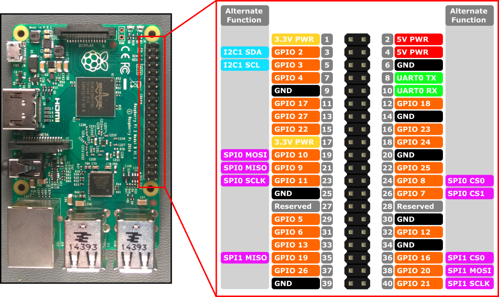

# Petstore Windows 10 IoT core demo client

## Build
1. Checkout and build `BuildAzure.IoT.Adafruit.BME280`
2. Change ULR for PetStore server in MainPage.xaml.cs:316 in this project
3. Select ARM and RemoteClient for deployment
4. Build & Deploy

## Sensors
**BME280** (also BMP180) is I2C slave, so connect I2C of RPI:
 - GND c (GND)
 - SDA to RPI GPIO pin 3 (I2C SDA) 
 - SDC to RPI GPIO pin 5 (I2C SDC) 
 - VIN to RPI GPIO pin 1 (VCC)
 

**DHT 22**
 - GND to RPI GPIO 20 (GND)
 - VCC to RPI GPIO pin 1 (VCC)
 - DATA to RPI GPIO 17
 - 