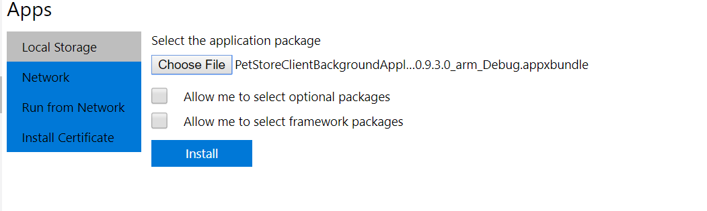
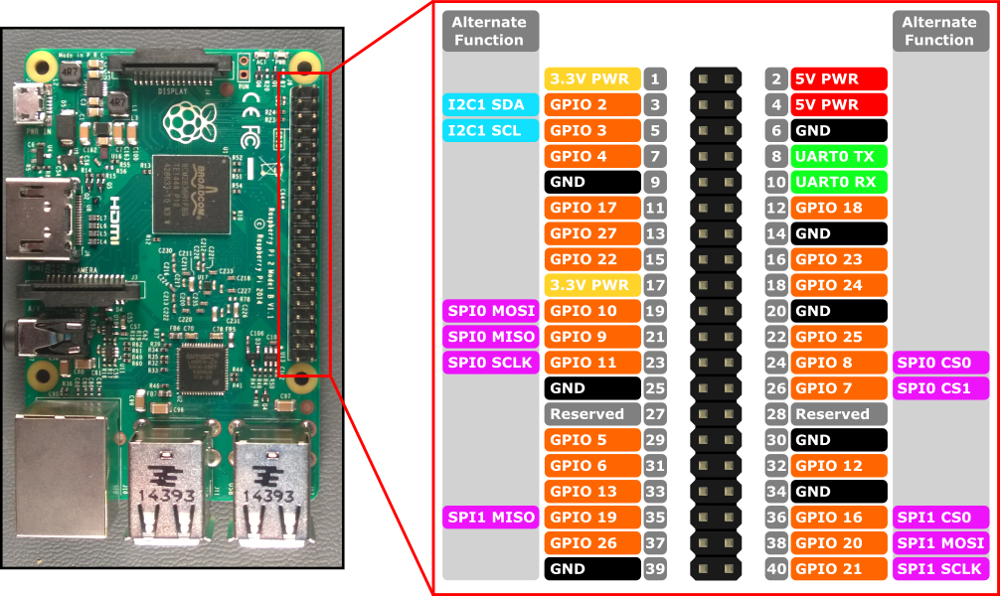
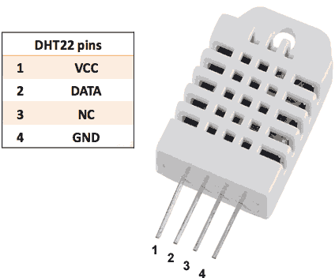

# InfluxData IoT Pet Store Demo Windows 10 IoT Core client

This is a Windows 10 IoT core client application for the [InfluxData IoT Pet Store Demo](https://github.com/bonitoo-io/influxdata-iot-petstore). 

In general, it reads data from [supported sensors](#suppported-sensors), calculates average values and send it to an InfluxDb 2.0 behind the Pet Store server.
It also reads 24h statistic data (min, mean, max) for each measurement. InfluxDb 2.0 communication is done with the help of [InfluxDb 2.0 .NET Client](https://github.com/bonitoo-io/influxdb-client-csharp)

Application consists of 3 main modules: 
 - [Background Job](PetStoreClientBackgroundApplication) - Handles all of the logic: Subcribing with Petsore Server, read sensor values, 
   writing to db and read statistical data from db.
 - [UWP GUI application](PetStoreUWPClient) - Displays measured and statistical data and allows configuration of the background job
 - [.NET Core console application](PetStoreConsoleClient) - displays measured and statistical data in console. Allows also configuration.

## Installation
1. Dowload latest binaries from the [releases](../../releases)
1. Goto the Windows 10 IoT Core web console
1. In the `Apps` section use Choose File and select PetStoreClientBackgroundApplication_<version>_arm_Debug.appxbundle
1. Check `Allow me to select framework packages`
    
1. Press `Install`.
1. On the next page add following file available also in releases:
     - `Microsoft.NET.Native.Runtime.2.2.appx`
1. press `Next`
1. Wait couple of seconds and `PetStoreClientBackgroundApplication`  will be shown in the app list
1. Change switch to be have the job autostart.
1. Install either `PetStoreUWPClient_<lastest-version>_arm_Debug.appxbundle` or use `PetStoreConsoleClient`  to change location and view measured data.

## Troubleshooting
1. Mount device: `net use r: \\<device-ip>\c$`
1. Check log at: `r:\Data\USERS\DefaultAccount\AppData\Local\Packages\PetStoreClientBackgroundApplication-uwp_yazx2sj32dc22\LocalState\MetroLogs` 

## Suppported Sensors
**BME280**  and **BMP180** are low power compact air temperature, humidity and pressure sensors from Bosch (BMP180 does't measure relative humidity).
They communicate over I2C, so connect it to I2C of RPI:
 - GND to (GND)
 - SDA to RPI GPIO pin 3 (I2C SDA) 
 - SDC to RPI GPIO pin 5 (I2C SDC) 
 - VIN to RPI GPIO pin 1 (VCC)
 

**DHT 22** is a temperature and humidity sensor communicating over proprietary 1 wire protocol. As it requires precice micro
seconds timing, the communication with Rasperry Pi is not reliable. Windows 10 IoT core has a lot of bacground activities 
which makes this difficult.

 - GND to RPI GPIO 20 (GND)
 - VCC to RPI GPIO pin 1 (VCC)
 - DATA to RPI GPIO 17
 
